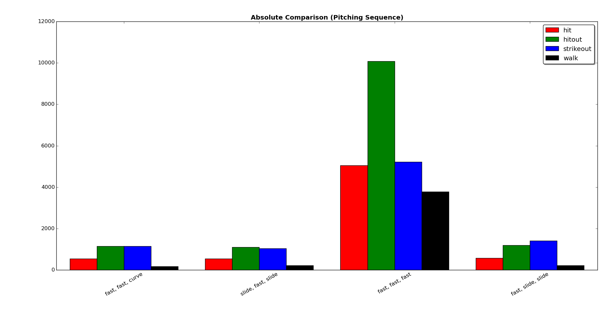
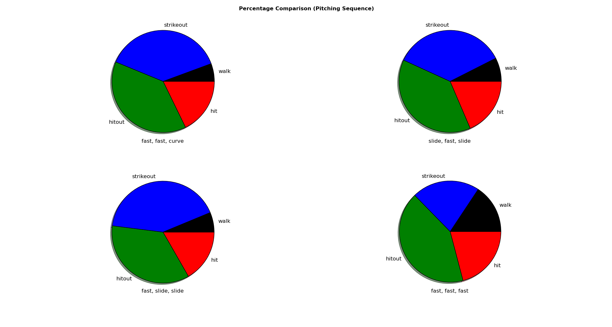
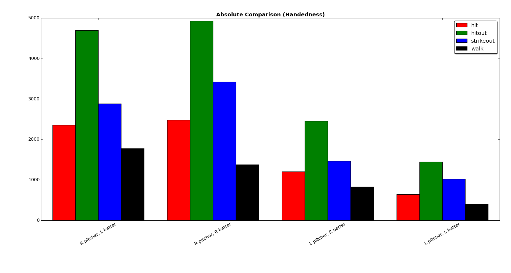
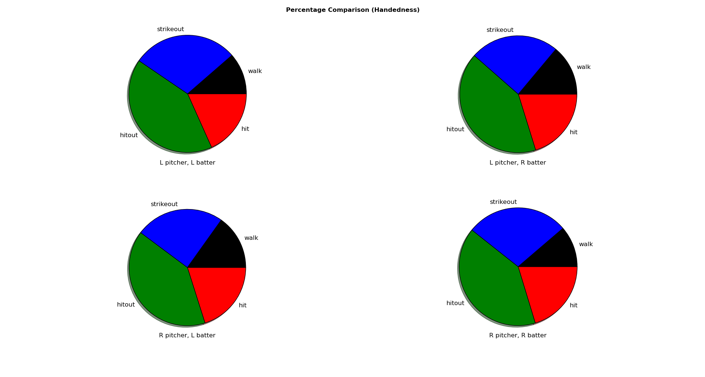

# pitchfx-analysis

##### NeuroScouting Dev Technical Problem #2

### Overview
This program first recursively searches all of the folders in the given data path for any inning files, then parses each data file and increments the appropriate result values for every valid atbat. Finally, bar and pie charts are made from the results.
The sequence bar charts show us that the most common ending pitching sequence by far is three fastballs, while the other three sequences are all fairly even. From the sequence pie charts, we can see that the three-fastball sequence is more likely to result in a walk than any of the other sequences, which tend to result in more strikeouts.
The handedness bar charts show us that most pitchers are right-handed, while the batters are pretty evenly split (with a slight lean towards right-handedness). From the handedness pie charts, we can see that there is little to no impact on the likeliness of any given outcome based on the handedness of either the pitcher or the batter.

### Organization
First, the `sys` module is used to read the (optional) data directory argument from the command-line. Then, we use the `os` module to walk through the data directory to find matching files. After, the `lxml` module provides an `etree` for parsing the XML data files and extracting our desired data.

### Control Flow
...

### Dependencies
...

### Example Usage
```
$ python pitchfx-analysis.py ./data/
```




